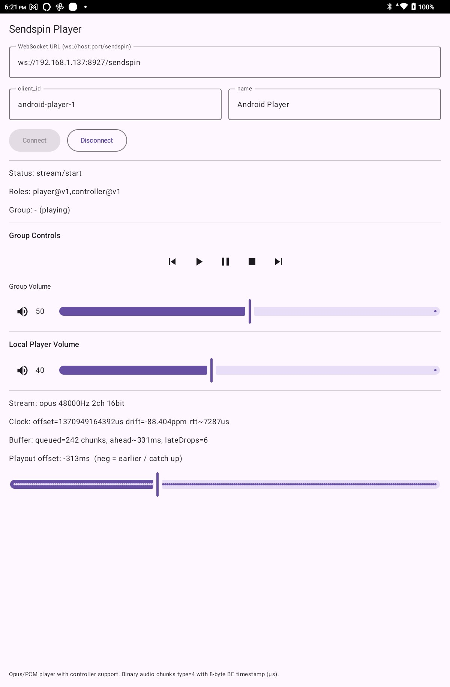

# SendSpin Android Player

An Android **SendSpin** client that acts as a synchronized network audio **player** and optional **controller**.
It connects to a SendSpin-compatible server over WebSocket, receives timestamped PCM or Opus audio frames,
performs clock synchronisation and jitter buffering, and plays audio in tight sync with other devices.



## Features

- **Synchronized audio playback**
  - Server–client clock alignment with drift estimation
  - Timestamp-based playout with adjustable real-time offset
- **Opus and PCM support**
  - Opus decoding via Concentus (pure Java)
  - 16‑bit PCM output using Android `AudioTrack`
- **Adaptive jitter buffering**
  - Late-frame detection and dropping
  - Startup and restart catch-up logic to avoid buffer deadlock
- **Controller role support**
  - Play / pause / stop / next / previous
  - Group volume and mute
- **Modern Android UI**
  - Jetpack Compose UI
  - Live diagnostics: offset, drift, RTT, buffer depth
  - Real-time playout offset slider for sync tuning

## Architecture Overview

- **SendspinPcmClient**
  - WebSocket protocol handling
  - Audio stream lifecycle
  - Clock sync, playout scheduling, and control commands
- **ClockSync**
  - RTT-based offset estimation
  - Drift calculation (ppm)
- **AudioJitterBuffer**
  - Timestamp-ordered queue
  - Late-drop and restart recovery logic
- **OpusDecoder**
  - Concentus-based Opus → PCM decoding
- **PcmAudioOutput**
  - Low-level AudioTrack streaming
- **PlayerViewModel / MainActivity**
  - Compose UI state and controls

## Protocol Notes

- Binary audio frames:
  - Type `0x04`
  - 8‑byte **big-endian server timestamp** (µs)
  - Followed by Opus or PCM payload
- JSON messages handle:
  - Handshake (`client/hello`, `server/hello`)
  - Time sync (`client/time`, `server/time`)
  - Stream lifecycle (`stream/start`, `stream/end`)
  - Controller and group state

## Usage

1. Build and install the app on an Android device.
2. Enter the WebSocket URL:
   ```
   ws://<host>:<port>/sendspin
   ```
3. Set a unique `client_id` and name.
4. Connect.
5. Adjust **Playout offset** if required to fine-tune sync with other SendSpin players.

## Requirements

- Android API 26+
- SendSpin-compatible server (homeassistant)

## Status

This project is functional but still experimental.
The UI exposes internal timing and buffering stats to aid debugging and sync tuning.

Issues:
- There is possibly a sync/pipeline issue where the playout offset (which is used to match the output of the app to the other playing devices in a group) can vary from one app run to another.  I have found myself using -160mS and -320mS to achieve the same results.  Needs investigation.
- Only foreground mode
- When a group is playing, and the app is connected, it won't play audio until a track change is forced on music assistant
- The local/group volume controls aren't working properly
- .... it hasn't had much testing!

This is vibe coded - so may have unintentional comments and/or code

---


